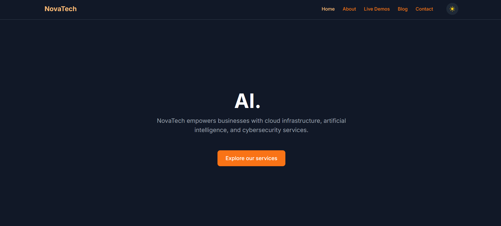
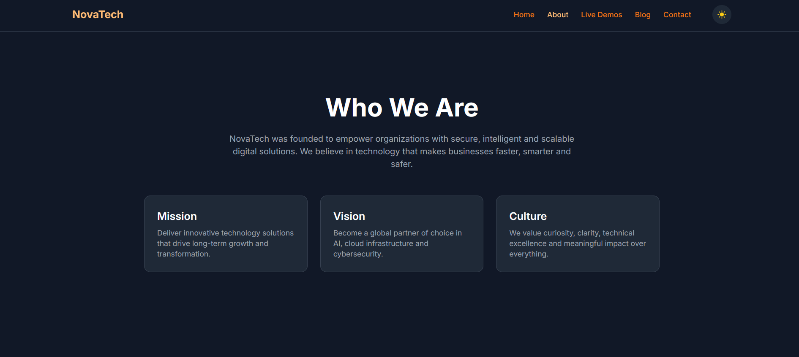
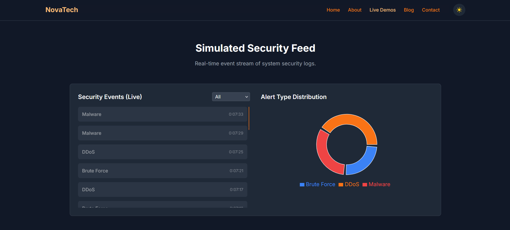

# NovaTech Solutions — Cloud, AI & Cybersecurity Platform

> _Secure. Scalable. Intelligent solutions for a digital-first world._

---

## 🧭 About NovaTech

**NovaTech Solutions** is a cutting-edge platform focused on **cloud infrastructure**, **AI-driven automation**, and **enterprise-grade security**.

Crafted with precision and clarity, the app delivers:

- ☁️ Cloud, AI, and security service overviews  
- 📊 Live demos for infrastructure, sentiment AI, and threat detection  
- 🎨 Visual design system and interactive styleguide  
- 🌓 Light/dark mode toggle with local preference  
- 🧪 CI-ready testing with Cypress 

---

## 🚀 Live Preview

👉 [https://novatech.quimromero.com/](https://novatech.quimromero.com/)

---

## ✨ Features

- 🧠 Real-time AI sentiment analysis demo  
- 🔒 Live security event feed with attack type breakdown  
- 📈 Infrastructure monitoring with CPU/memory graphs  
- 💡 Visual styleguide showcasing design tokens  
- 🌗 Dark/light mode support  
- 📱 Fully responsive layout  
- 🧪 E2E tests via Cypress 

---

## 🧠 Tech Stack

| Tech                        | Role                                       |
|-----------------------------|--------------------------------------------|
| **React + Vite**            | Frontend framework and dev server          |
| **Framer Motion**           | Animation and transitions                  |
| **Tailwind CSS**            | Styling with custom design tokens          |
| **Recharts + Chart.js**     | Visual data components                     |
| **React Hook Form + Yup**   | Validated contact form                     |
| **React Helmet Async**      | SEO meta management                        |
| **Cypress**                 | Unit testing                               |
| **GitHub Actions**          | Continuous integration                     |

---

## 🗂 Project Structure

- `src/`
  - `components/` – Reusable UI: charts, modals, tabs, demos
  - `pages/` – Main routes: Home, About, Contact, Showcase, Blog
  - `hooks/` – Custom logic for dark mode, persistence, reduced motion
  - `data/` – Blog and services data
- `cypress/` – Unit test setup and coverage
- `public/` – Static assets and favicons

---

## 🧪 End-to-End Testing

NovaTech includes E2E tests using **Cypress**, integrated via **GitHub Actions** for each PR and push.

Currently tested:

- ✅ Home and CTA visibility
- ✅ Contact form renders and submits

Coming soon:

- 🧠 Sentiment analysis interaction
- 🔒 Security feed filters and updates
- 📈 Infrastructure graph assertions

🧪 [View CI status →](https://github.com/quim-romero/novatech/actions)

---

## 📸 Screenshots

| Home | About | Security Feed |
|------|---------|---------------|
|  |  |  |

---

## 🧩 Notes

- ✨ Built from scratch — no templates used  
- 💡 Designed as a modern portfolio case study  
- 🔐 Focused on performance, accessibility and clarity  

---

## 📬 Contact

Looking for a frontend engineer who blends design with engineering precision?

- 📧 quim@quimromero.com  
- 🌐 [https://novatech.quimromero.com/](https://novatech.quimromero.com/)

---

> _NovaTech bridges powerful tech with human-centered design —  
> empowering digital growth with trust, speed and intelligence._
